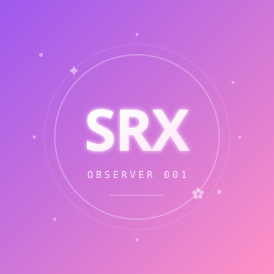

# SRX · 个人观察站

> 一个简洁而克制的个人主页。
> 设计与原站 `HXY-0124` 同源，复用了相同的紫粉宇宙色系与组件结构。

🌐 **在线预览**：[https://srx20030317-arch.github.io/resume/](https://srx20030317-arch.github.io/resume/)

---

## 📁 文件结构

```
├── index.html              ← 首页（含启动门）
├── about.html              ← 关于我（详细，预留页）
├── projects.html           ← 项目展示（预留页）
├── experience.html         ← 经历时间线（预留页）
├── styles.css              ← 全站样式
├── script.js               ← 全站交互脚本
├── assets/
│   └── photos/
│       └── avatar.svg      ← 头像占位图（请替换为您的照片）
├── README.md               ← 本文件
└── DEPLOY.md               ← 部署指南
```

---

## 🎨 设计风格

- **色系**：紫粉宇宙风（与 HXY-0124 同源）
- **字体**：DM Sans（英文）+ Noto Sans SC（中文）+ JetBrains Mono（代码字体）
- **特色**：
  - 启动门入场（点击头像进入）
  - canvas 实时星空动画
  - 明暗双主题（localStorage 持久化）
  - 3 束人格信号收集
  - 全响应式（移动端汉堡菜单）
  - 滚动入场动画

---

## 🚀 快速开始

### 本地预览

```powershell
# 在项目目录下
python -m http.server 8000

# 或使用 Node.js
npx http-server

# 或使用 VS Code 的 Live Server 插件
```

然后访问 http://localhost:8000

### 部署到 GitHub Pages

详见 [DEPLOY.md](./DEPLOY.md)

---

## 🔌 已预留的接口（用于扩展）

当前架构已为未来页面准备好钩子：

| 预留页面 | 文件 | 状态 |
|---|---|---|
| 关于我（详细） | `about.html` | ✅ 占位完成 |
| 项目展示 | `projects.html` | ✅ 占位完成 |
| 经历时间线 | `experience.html` | ✅ 占位完成 |
| 照片墙 | （未创建） | 📋 计划中 |
| 博客 / 文章 | （未创建） | 📋 计划中 |
| 原创电台 | （未创建） | 📋 计划中 |

### 如何新增一个页面

1. 复制 `about.html` 作为模板
2. 修改 `<title>`、`<h1>` 等关键内容
3. 在所有 HTML 的 `<nav class="site-nav">` 中添加链接
4. 推送到 GitHub

### 页面间跳转

所有页面顶部导航的链接都已配置好：
- 首页内的锚点跳转：`#top` / `#identity` / `#contact` / `#future-sections`
- 跨页面跳转：`about.html` / `projects.html` / `experience.html`

---

## ✏️ 自定义内容

### 替换头像

将您的照片命名为 `avatar.jpg`，放到 `assets/photos/`，然后修改所有 HTML：

```html
<!-- 替换前 -->


<!-- 替换后 -->

```

### 修改联系方式

编辑 `index.html` 的 `#contact` 区。

### 修改主题色

编辑 `styles.css` 的 `:root` 变量。

---

## 🛠️ 技术栈

- HTML5
- CSS3（CSS Variables + Grid + Flexbox）
- Vanilla JavaScript（无第三方依赖）
- Canvas 2D（启动门星空）
- IntersectionObserver（滚动入场）
- localStorage（主题持久化）
- sessionStorage（信号收集）

---

## 📝 版本

**V1.0** - 2026-09-22
- 首页 + 3 个预留页
- 启动门入场动画
- 明暗双主题
- 联系方式区
- 信号收集系统（3 束）
- 全响应式

---

## 📄 版权

本站源代码采用 MIT 协议开源，您可以自由使用、修改、分发。
原设计风格参考自 [hahaaa520/hxy-0124](https://hahaaa520.github.io/hxy-0124/)。
